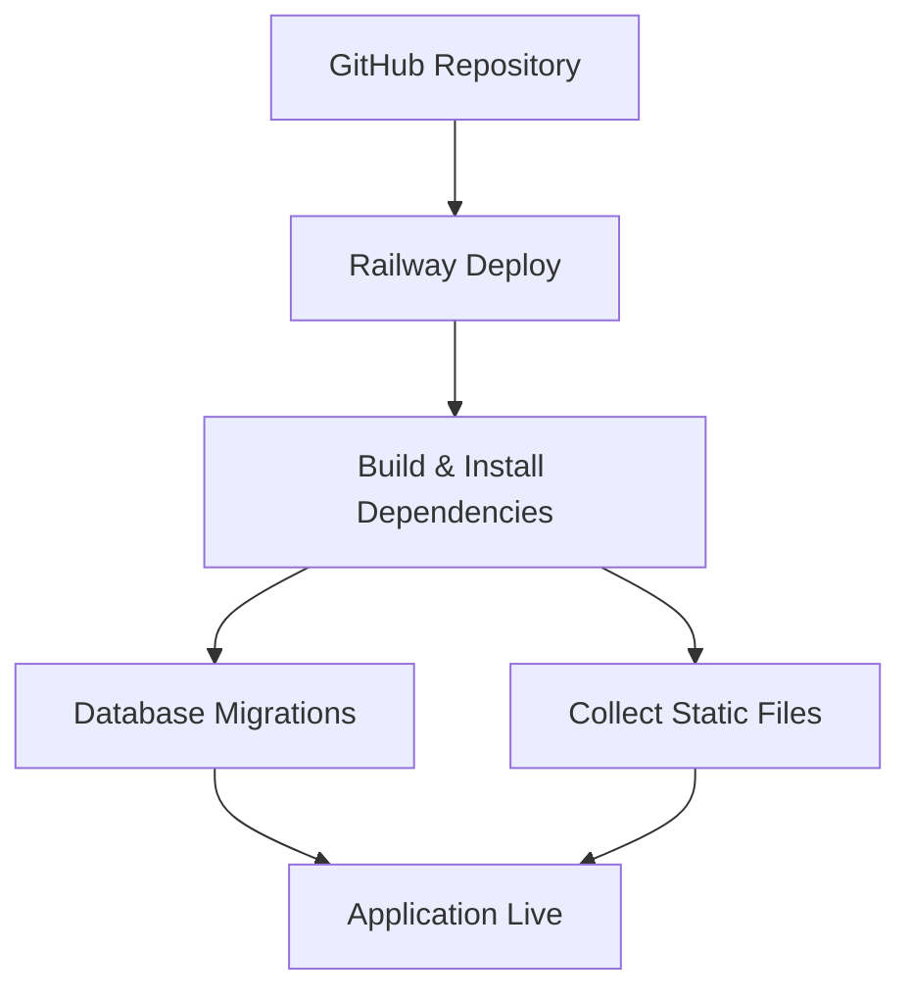

# 📘 Library Project – Django REST API

  
*Complete Library Management REST API with Django and Django REST Framework*

---

## Features

- JWT Authentication (`rest_framework_simplejwt`)  
- User registration & login (`dj-rest-auth` + `django-allauth`)  
- CRUD operations for Books (list, create, retrieve, update, partial_update, delete)  
- Pagination and Swagger/OpenAPI documentation (`drf-spectacular`)  
- Password validation & secure session management  
- Static files served with WhiteNoise  

---

## Project Structure

```
library-project/
├─ accounts/              # User management app
├─ books/                 # Books management app
├─ library_project/       # Django project settings
├─ static/                # Custom static files (CSS, JS, images)
├─ staticfiles/           # Collected static files (WhiteNoise)
├─ .env                   # Environment variables (ignored in git)
├─ manage.py
├─ requirements.txt
├─ Pipfile / Pipfile.lock
├─ Procfile
├─ runtime.txt
```

---

## Installation (Development)

```bash
# Clone the repo
git clone https://github.com/<username>/library-project-deploy.git
cd library-project-deploy

# Install dependencies
pipenv install
pipenv shell

# Apply migrations
python manage.py makemigrations
python manage.py migrate

# Collect static files
python manage.py collectstatic --noinput

# Run server
python manage.py runserver
```

---

## Deployment (Railway)

### 1 Railway Project Setup
- Login to Railway → New Project → Deploy from GitHub
- Select your repository `library-project-deploy`

### 2 Environment Variables
Set the following in Railway:

```env
SECRET_KEY=<your-secret-key>
DEBUG=False
ALLOWED_HOSTS=*
DB_NAME=db.sqlite3
LANGUAGE_CODE=en-us
TIME_ZONE=Asia/Tashkent
```

### 3 Deploy & Build
- Railway automatically installs dependencies from `requirements.txt`
- If needed, run in Railway Console:

```bash
python manage.py migrate
python manage.py collectstatic --noinput
```

### 4 Access App
Open the Railway URL:
```
https://<your-project>.up.railway.app/api/books/
```

---

## Deployment Flow Diagram



---

## License

MIT License © 2025 Uktam Turgunov